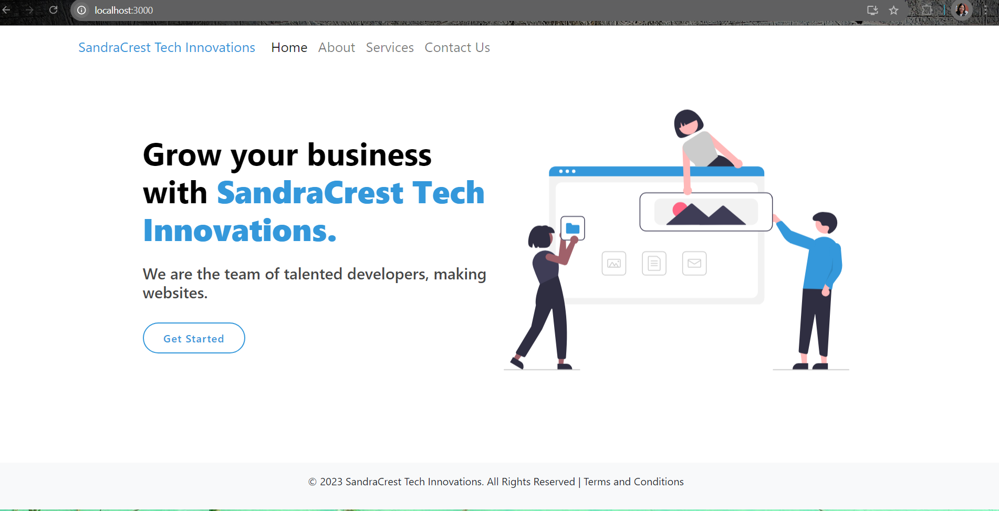
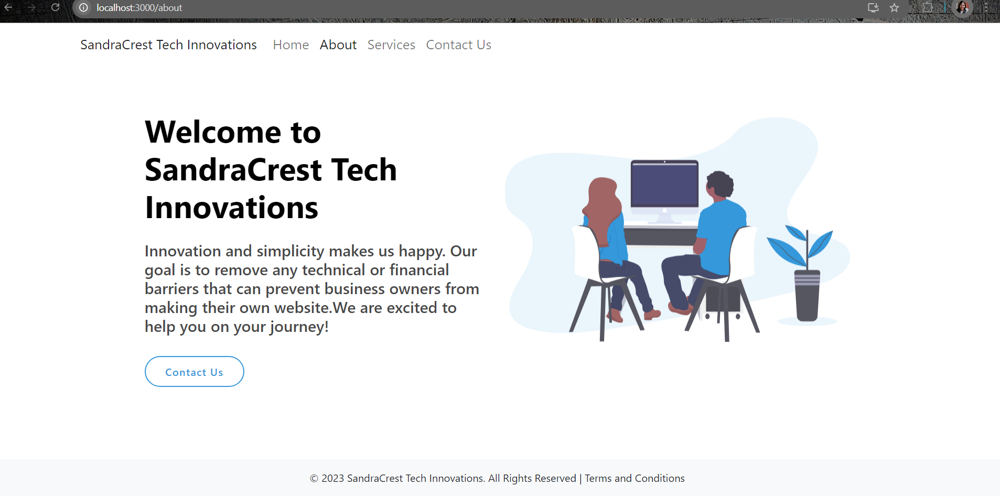
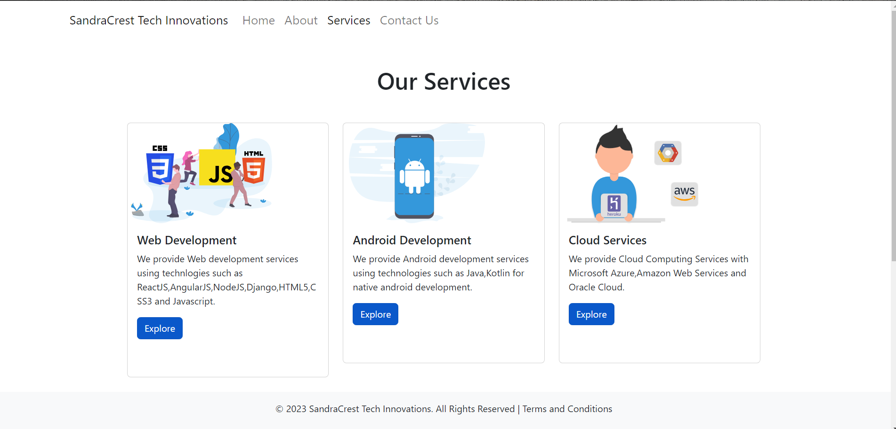
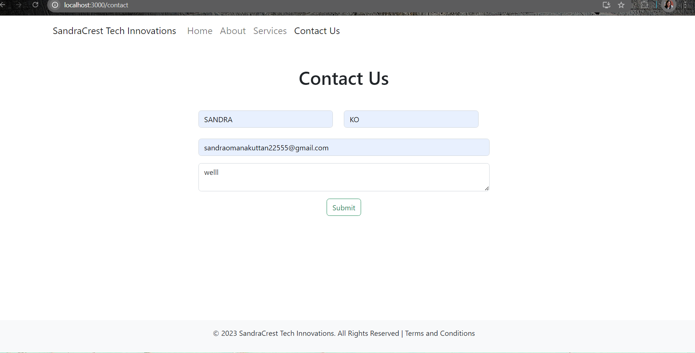

# SandraCrest Innovation Technologies

## Project Overview
This project is a fully responsive IT solutions provider company website for **SandraCrest Innovation Technologies**, created using React.js.


## Screenshots

### Home Page

  
*(This is the home page showcasing various services and a call-to-action button.)*

---

### About Page


*(The about page includes company vision, mission, and goals.)*

---

### 


*(Details of the previous events conducted by the company.)*

---

### contact


*(A gallery showcasing images of events, clients, and projects.)*

---

## Features
- **Responsive Design**: Works seamlessly on mobile, tablet, and desktop.
- **Clean UI**: Simple and elegant design using Bootstrap and custom CSS.
- **Interactive Components**: Includes hover effects, animations, and modals.

---

## Installation
1. Clone the repository:
    ```bash
    git clone https://github.com/sandraomanakuttan/Sandra-Crest-Innovation-Technologies.git
    ```

2. Navigate to the project directory:
    ```bash
    cd Sandra-Crest-Innovation-Technologies
    ```

3. Install dependencies:
    ```bash
    npm install
    ```

4. Run the development server:
    ```bash
    npm start
    ```

---

## Future Enhancements
- Add backend functionality for the contact form.
- Enhance the photo gallery with interactive features.
- Integrate SEO best practices.

## License
This project is licensed under the MIT License.
